# OSCA

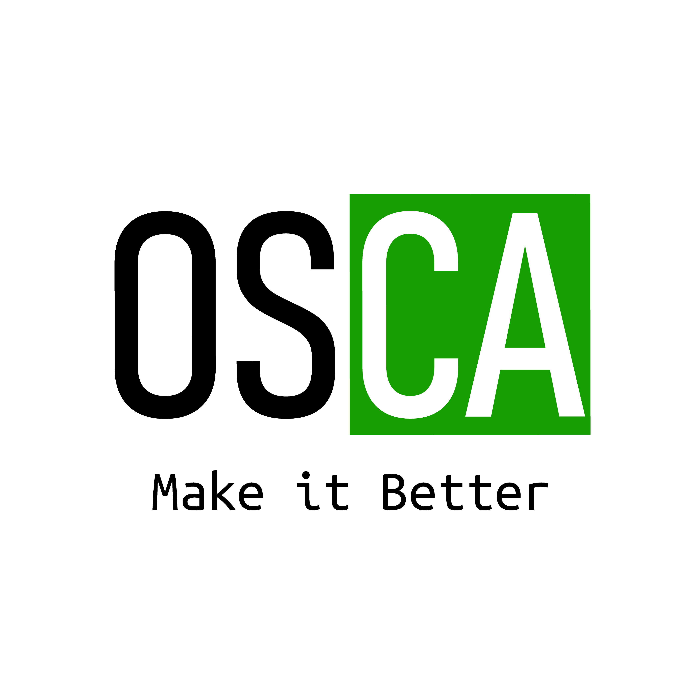

欢迎来到OSCA主页！

OSCA团队隶属于信息工程学院本科生实验室，在徐长波副院长带领下，由张浩睿、李湘敏、张梦飞与2023届本科新生于2023年9月正式创建。OSCA即操作系统与计算机体系结构（Operating Systems and Computer Architecture）的缩写，同时也明确了本团队的主要学习研究方向为诸如操作系统、计算机体系结构等泛系统领域。

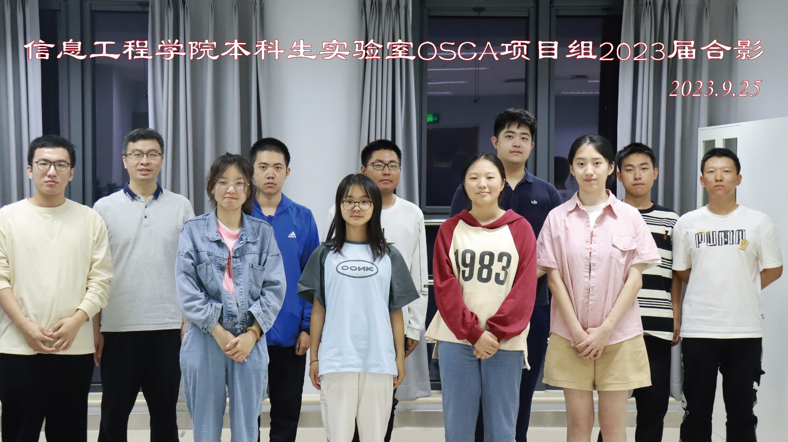

本团队立足于本科生培养与教育，深耕计算机基础知识，通过优质课程与工程实践使学生得到成长，迈向更广阔的发展天地。同时，我们还为泛系统领域内的各个子方向的学习路线做出了较为合理的安排，并与国内主流开源培养方案对接（如一生一芯、开源操作系统训练营等）。

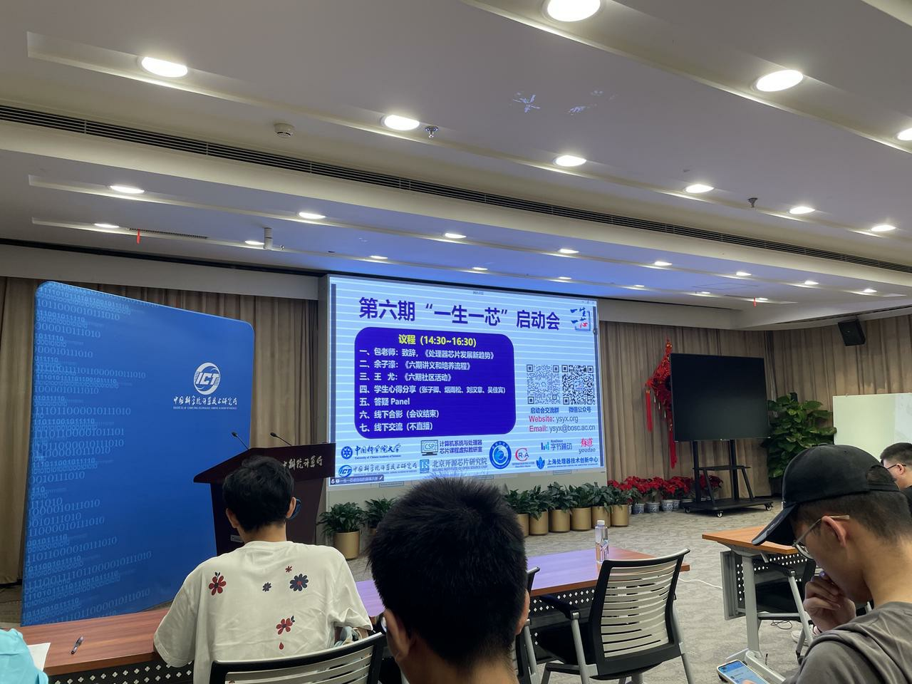

针对本科生培养与教育，本团队基于众多国内外优质计算机课程，以升学为团队主要目标，通过结合实际水平的方式，已积累两届培养方案，每年更新大版本，不定期修正；同时，本团队积极开展团队内交流工作，通过双周会的方式实现目标考核、知识宣讲、开放讨论；本团队还针对每一位同学的具体情况，基于当年的培养方案，通过一对一的方式帮助其定制适合个人的执行方案；本团队成员积极参与全国性学术会议，密切接触计算机发展前沿；本团队还针对日常生活技巧、个人精力管理、专业选课方案、学校政策文件解读等密切联系新生学习生活的内容进行了专门建档与迭代优化。

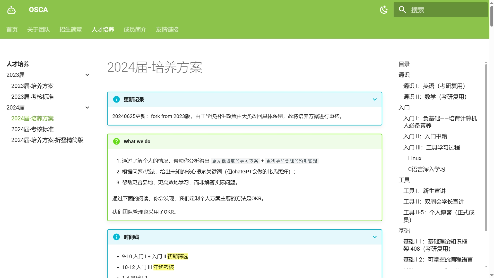

双周会宣讲：

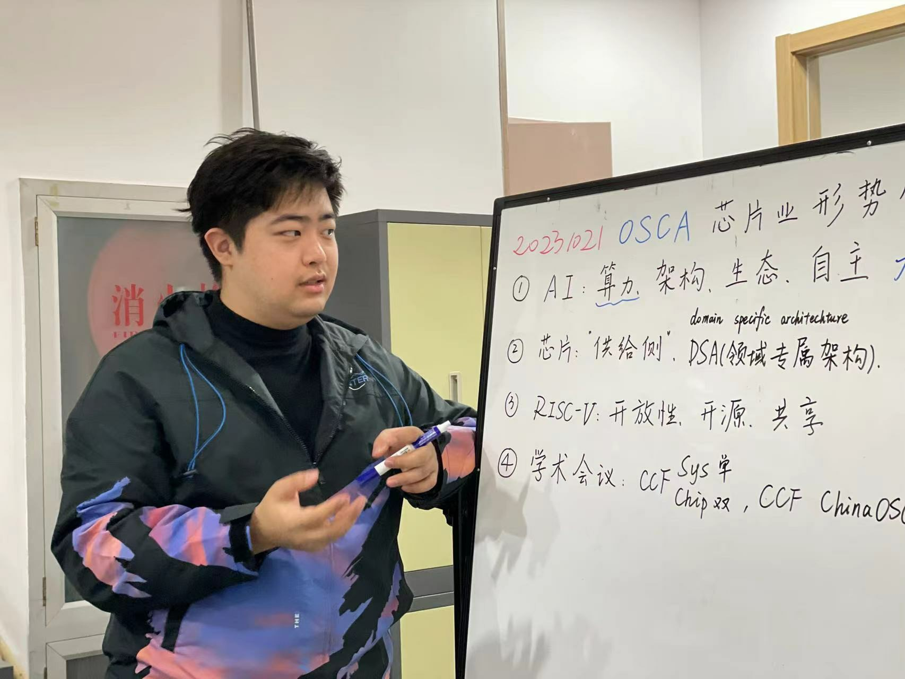
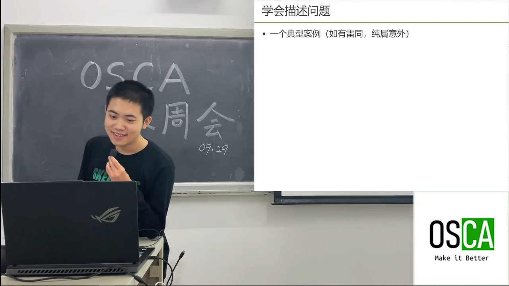

双周会：

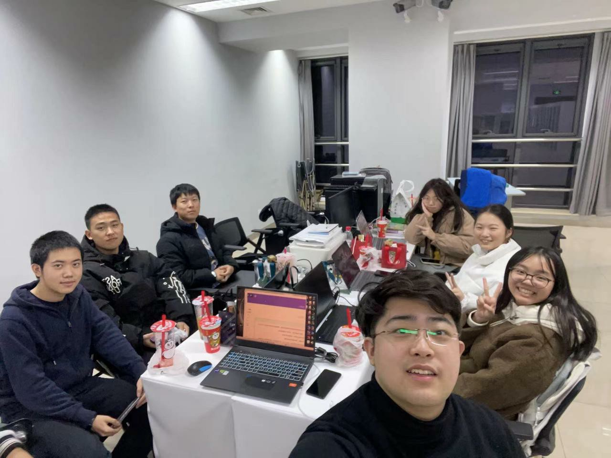
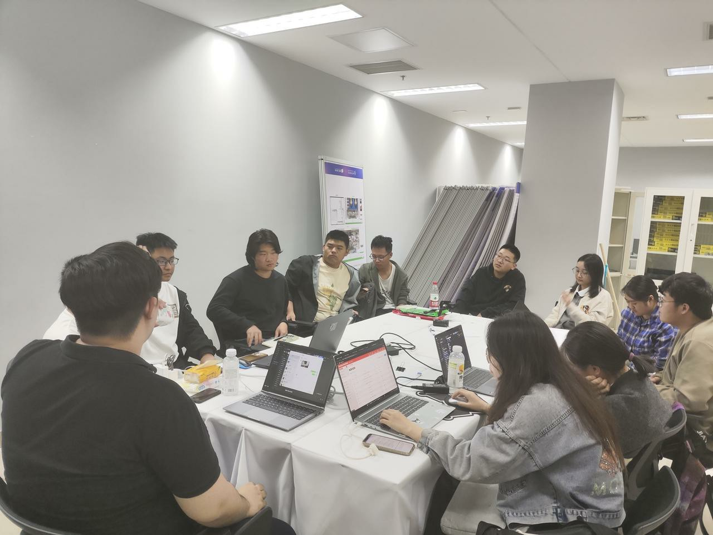

参加学术会议：

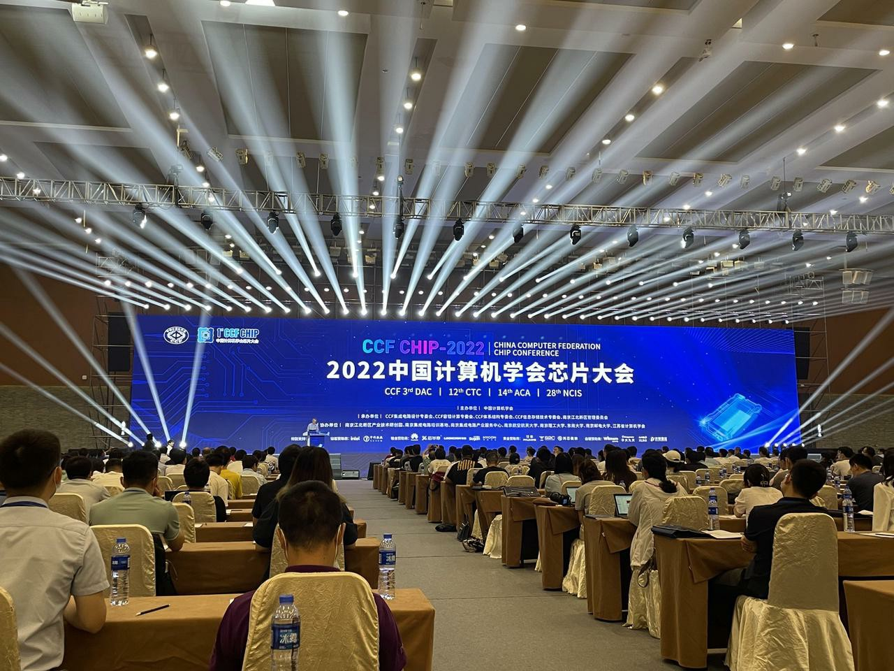
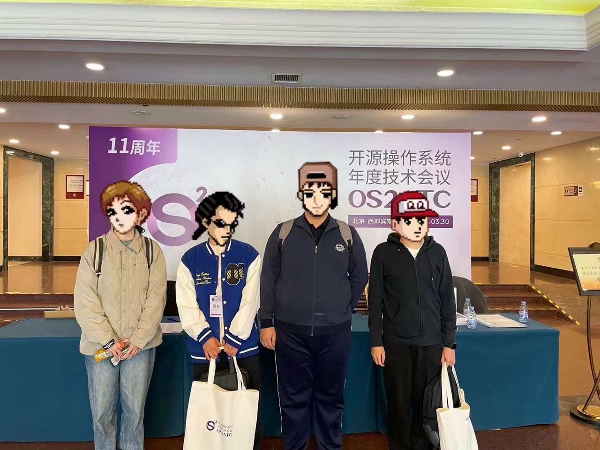

**本团队承担了本科生实验室的资料库搭建与维护工作，目前已投入使用。**

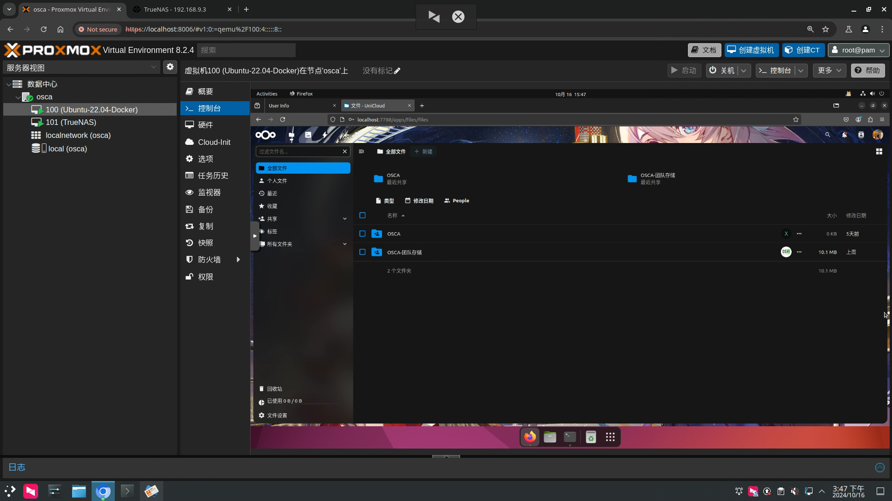
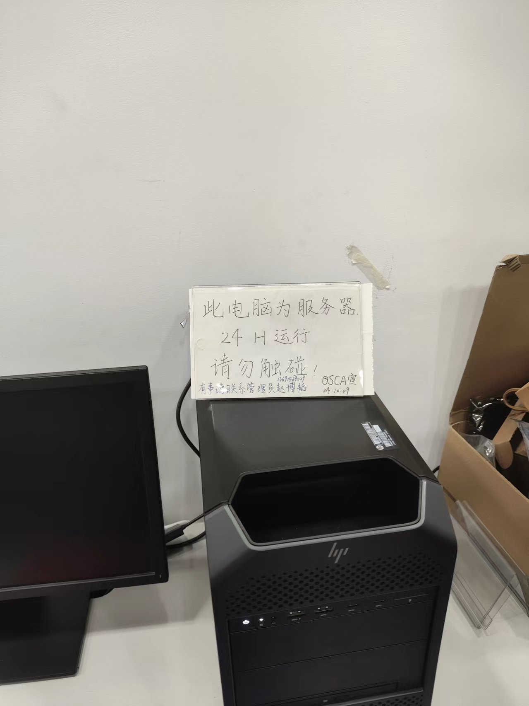

目前，本团队已有本科生11人，2022届1人，2023届4人，2024届6人。故本团队仍处于培养与发展阶段。未来还将结合所学知识，积极参与到泛系统领域与计算机领域内的本科生竞赛中。

??? info "目录"

    - [关于团队](/about/about)
    - [人才培养](/guide/index)
        - [2024届-培养方案](/guide/guide-2024)
    - [招生简章](/recruit/recruit)
    - [成员简介](/members/members)
    - [友情链接](/members/links)